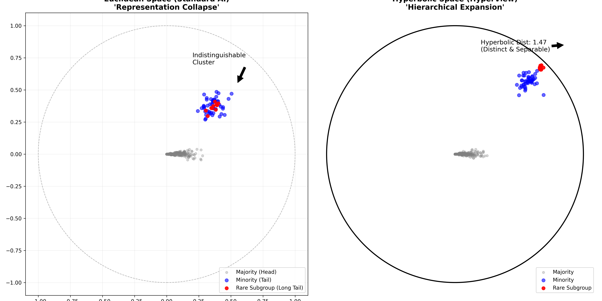

# HyperView

> **HyperView is an open‑source curation engine that lets teams explore, clean, and balance multimodal datasets at million‑sample scale on modest hardware.**

[](https://opensource.org/licenses/MIT)
[](https://HackerRoomAI.github.io/HyperView/)

Instead of flattening hierarchies into Euclidean scatterplots, HyperView uses native **hyperbolic embeddings** and a **Poincaré‑disk interface** to surface long‑tail classes, label drift, and duplicate data.

---

<p align="center">
  <a href="https://HackerRoomAI.github.io/HyperView/">
    
  </a>
  <br>
  <em>Figure 1: Representation Collapse in Euclidean space vs. Hierarchical Expansion in Hyperbolic space.</em>
</p>

<p align="center">
  <a href="https://HackerRoomAI.github.io/HyperView/" style="font-size: 1.2em; font-weight: bold;">🔴 Try the Interactive Visualization</a>
</p>

---

## Abstract

Modern AI curation tools rely almost exclusively on Euclidean embeddings (Cosine similarity, L2 distance). While effective for flat data, Euclidean space has a fundamental mathematical flaw when dealing with the complex, hierarchical data found in the real world (biology, medical imaging, social demographics): **volume grows polynomially ($r^d$)**.

As datasets grow, the space fills up. To fit a massive "Majority" group, the embedding model is forced to crush "Minority" subgroups together, a phenomenon we term **Representation Collapse**.

HyperView leverages **Hyperbolic Geometry** (specifically the Poincaré disk model), where volume grows **exponentially** ($e^r$). This allows "Minority" and "Rare" groups to be pushed to the edge of the embedding space *without* losing their internal structure or separation.

## Key Features

*   **Native Hyperbolic Embeddings:** Utilizes the Poincaré ball model to naturally represent hierarchical data structures without distortion.
*   **Fairness-Aware Curation:** Mathematically guarantees that long-tail and minority samples remain distinct and retrievable, preventing them from being "crushed" by majority classes.
*   **Million-Scale Performance:** Designed with a Rust core extending Qdrant with custom non-Euclidean distance metrics (Proof of Concept).
*   **Hybrid Architecture:** Seamless integration of Python (PyTorch/Geoopt) for model adaptation and WebGL for high-performance browser visualization.

## Repository Structure

This repository serves as a **Showcase** for the HyperView technology stack.

*   `poc/bias_demonstration.py`: A simulation script using `geomstats` to mathematically prove the "Representation Collapse" in Euclidean space.
*   `poc/hyperbolic_adapter.py`: A minimal PyTorch implementation using `geoopt` to project standard Euclidean vectors (e.g., CLIP) into the Poincaré ball.
*   `docs/index.html`: The source code for the interactive WebGL visualization.
*   `docs/architecture.md`: Detailed system design for the full engine.

## Quick Start

### Prerequisites

*   Python 3.10+
*   `pip`

### Installation

```bash
git clone https://github.com/HackerRoomAI/HyperView.git
cd HyperView
pip install -r requirements.txt
```

### Reproducing the Visuals

To generate the comparison figure (Figure 1) locally:

```bash
python poc/bias_demonstration.py
```

To run the hyperbolic adapter demo:

```bash
python poc/hyperbolic_adapter.py
```

To run the interactive visualization locally:

```bash
python -m http.server 8000
# Open http://localhost:8000/docs/index.html
```

## Architecture

HyperView employs a "Hybrid Engine" approach:
1.  **Ingestion:** `HyperbolicAdapter` (Python) projects raw embeddings to the manifold.
2.  **Storage:** Custom Rust-based vector engine (Qdrant fork) indexes data using Poincaré distance.
3.  **Visualization:** WebGL frontend renders the Poincaré disk directly using custom shaders.

See [docs/architecture.md](docs/architecture.md) for details.

## License

This project is licensed under the MIT License - see the [LICENSE](LICENSE) file for details.
