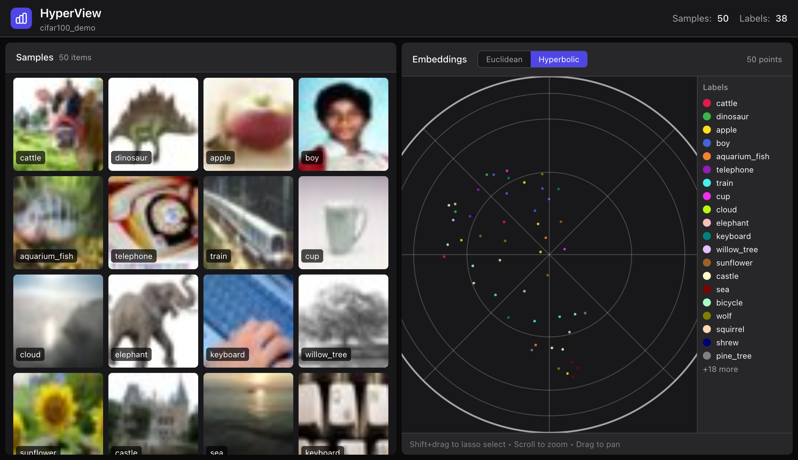

# HyperView

> **Open-source dataset curation with hyperbolic embeddings visualization - a FiftyOne alternative.**

[](https://opensource.org/licenses/MIT)

<p align="center">
  <a href="https://youtu.be/XLaa8FHSQtc" target="_blank">
    
  </a>
  <br>
  <a href="https://youtu.be/XLaa8FHSQtc" target="_blank">Watch the Demo Video</a>
</p>

---

## Features

- **Dual-Panel UI**: Image grid + scatter plot with bidirectional selection
- **Euclidean/Hyperbolic Toggle**: Switch between standard 2D UMAP and Poincaré disk visualization
- **HuggingFace Integration**: Load datasets directly from HuggingFace Hub
- **Fast Embeddings**: Uses EmbedAnything for CLIP-based image embeddings
- **FiftyOne-like API**: Familiar workflow for dataset exploration

## Quick Start

### Option 1: Using DevContainer (Recommended for Development)

The fastest way to get started is using the pre-configured development container that works on **macOS (ARM64/Intel)**, **Linux (AMD64)**, and **GitHub Codespaces**:

**Local Development (macOS/Linux):**

1. **Install Prerequisites:**
   - [Docker Desktop](https://www.docker.com/products/docker-desktop/) - **Required for local development**
   - [VSCode](https://code.visualstudio.com/) with the [Dev Containers extension](https://marketplace.visualstudio.com/items?itemName=ms-vscode-remote.remote-containers)

2. **Verify Docker is Running:**
   ```bash
   # Make sure Docker Desktop is fully started before proceeding
   docker ps
   ```
   If this command hangs or fails, restart Docker Desktop and wait for it to fully initialize (the whale icon should be steady, not animated).

3. **Clone and Open:**
   ```bash
   git clone https://github.com/HackerRoomAI/HyperView.git
   cd HyperView
   code .
   ```

4. Click "Reopen in Container" when prompted (or use Command Palette: "Reopen in Container")
5. Wait for setup to complete (~5-10 minutes first time)
6. You're ready to code! All dependencies are pre-installed.

**Troubleshooting (macOS/Linux):**

If container build hangs or takes too long:
- **Check Docker Desktop status**: Ensure it's running and responsive (`docker ps` should return quickly)
- **Restart Docker Desktop**: Quit completely and restart if commands are hanging
- **Check resources**: Allocate at least 4GB RAM in Docker Desktop settings
- **Cancel and retry**: Press Ctrl+C and try "Reopen in Container" again after Docker stabilizes

For more troubleshooting, see [.devcontainer/README.md](.devcontainer/README.md#troubleshooting).

**GitHub Codespaces (No Docker Required):**

1. Go to the [HyperView repository](https://github.com/HackerRoomAI/HyperView)
2. Click **Code** → **Codespaces** → **Create codespace on main**
3. Wait for environment to initialize (~5-10 minutes first time)
4. Start coding in your browser or connect with VSCode!

See [.devcontainer/README.md](.devcontainer/README.md) for detailed documentation.

### Option 2: Local Installation

```bash
git clone https://github.com/HackerRoomAI/HyperView.git
cd HyperView

# Install with uv
uv venv .venv
source .venv/bin/activate
uv pip install -e .

# For development (includes pre-commit hooks)
uv pip install -e ".[dev]"
pre-commit install
```

### Run the Demo

```bash
hyperview demo --samples 500
```

This will:
1. Load 500 samples from CIFAR-100
2. Compute CLIP embeddings
3. Generate Euclidean and Hyperbolic visualizations
4. Start the server at **http://127.0.0.1:5151**

### Python API

```python
import hyperview as hv

# Create dataset
dataset = hv.Dataset("my_dataset")

# Load from HuggingFace
dataset.add_from_huggingface(
    "uoft-cs/cifar100",
    split="train",
    max_samples=1000
)

# Or load from local directory
# dataset.add_images_dir("/path/to/images", label_from_folder=True)

# Compute embeddings and visualization
dataset.compute_embeddings()
dataset.compute_visualization()

# Launch the UI
hv.launch(dataset)  # Opens http://127.0.0.1:5151
```

### Save and Load Datasets

```python
# Save dataset with embeddings
dataset.save("my_dataset.json")

# Load later
dataset = hv.Dataset.load("my_dataset.json")
hv.launch(dataset)
```

## Why Hyperbolic?

Traditional Euclidean embeddings struggle with hierarchical data. In Euclidean space, volume grows polynomially ($r^d$), causing **Representation Collapse** where minority classes get crushed together.

**Hyperbolic space** (Poincaré disk) has exponential volume growth ($e^r$), naturally preserving hierarchical structure and keeping rare classes distinct.

<p align="center">
  
</p>

## Architecture

```
hyperview/
├── src/hyperview/
│   ├── core/           # Dataset, Sample classes
│   ├── embeddings/     # EmbedAnything + UMAP + Poincaré projection
│   └── server/         # FastAPI + static frontend
├── frontend/           # React/Next.js (compiled to static)
└── scripts/
    └── demo.py         # Demo script
```

**Tech Stack:**
- **Backend**: Python, FastAPI, EmbedAnything, UMAP
- **Frontend**: Next.js 16, React 18, regl-scatterplot, Zustand, Tailwind CSS
- **Package Manager**: uv

## Development

### Frontend Development (with Hot Reloading)

For the best development experience, run the backend and frontend separately:

**Terminal 1 - Start the Python backend:**
```bash
# Activate your virtual environment first
source .venv/bin/activate

# Run the demo script in no-browser mode
python scripts/demo.py --samples 200 --no-browser
```
This runs the API on **http://127.0.0.1:5151**

**Terminal 2 - Start the frontend dev server:**
```bash
cd frontend
npm install  # First time only
npm run dev
```
This runs the frontend on **http://localhost:3000** with hot reloading.

Open **http://localhost:3000** in your browser. The frontend automatically proxies `/api/*` requests to the backend at port 5151 (configured in `next.config.ts`).

Now you can:
- Edit React components and see changes instantly
- Edit Python backend and restart Terminal 1
- No need to rebuild/export the frontend during development

### Export Frontend for Production

When you're ready to bundle the frontend into the Python package:

```bash
./scripts/export_frontend.sh
```

This compiles the frontend and copies it to `src/hyperview/server/static/`. After this, `hv.launch()` serves the bundled frontend directly from the Python server.

### Code Quality

The project uses pre-commit hooks to ensure code quality:

```bash
# Install dev dependencies (includes pre-commit)
uv pip install -e ".[dev]"

# Install pre-commit hooks
pre-commit install

# Run manually on all files
pre-commit run --all-files
```

**What runs on commit:**

- **Ruff**: Python linting and formatting (configured in [pyproject.toml](pyproject.toml))
- **ESLint**: Frontend TypeScript/JavaScript linting
- **Standard checks**: Trailing whitespace, YAML/JSON/TOML validation, large file detection

You can also run checks manually:

```bash
# Python linting and formatting
ruff check src/
ruff format src/

# Frontend linting
cd frontend && npm run lint
```

## API Endpoints

| Endpoint | Description |
|----------|-------------|
| `GET /api/dataset` | Dataset metadata (name, labels, colors) |
| `GET /api/samples` | Paginated samples with thumbnails |
| `GET /api/embeddings` | 2D coordinates (Euclidean + Hyperbolic) |
| `POST /api/selection` | Sync selection state |

## References

- [Poincaré Embeddings for Learning Hierarchical Representations](https://arxiv.org/abs/1705.08039) (Nickel & Kiela, 2017)
- [Hyperbolic Neural Networks](https://arxiv.org/abs/1805.09112) (Ganea et al., 2018)
- [FiftyOne](https://github.com/voxel51/fiftyone) - Inspiration for the UI/API design

## License

MIT License - see [LICENSE](LICENSE) for details.
