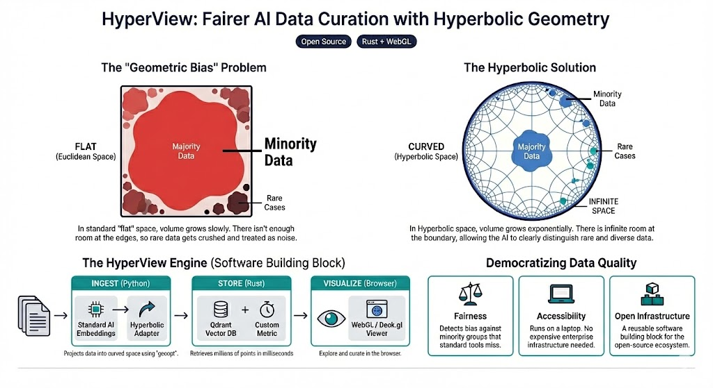

# HyperView

> **HyperView is an open‑source curation engine that lets teams explore, clean, and balance multimodal datasets at million‑sample scale on modest hardware.**

[](https://opensource.org/licenses/MIT)
[](https://HackerRoomAI.github.io/HyperView/)

<p align="center">
  
</p>

<p align="center">
  <a href="https://HackerRoomAI.github.io/HyperView/" style="font-size: 1.2em; font-weight: bold;">🔴 Try the Interactive Visualization</a>
</p>

---

## Abstract

Modern AI curation tools rely almost exclusively on Euclidean embeddings (Cosine similarity, L2 distance). While effective for flat data, Euclidean space has a fundamental mathematical flaw when dealing with the complex, hierarchical data found in the real world (biology, medical imaging, social demographics): **volume grows polynomially ($r^d$)**.

As datasets grow, the space fills up. To fit a massive "Majority" group, the embedding model is forced to crush "Minority" subgroups together, a phenomenon we term **Representation Collapse**.

### The "Hidden Diagnosis" Problem (Example)

Imagine training an AI doctor on 10,000 chest X-rays:
*   **9,000 Healthy** (Majority)
*   **900 Common Pneumonia** (Minority)
*   **100 Rare Early-Stage Tuberculosis** (Rare Subgroup)

In **Euclidean space**, the model runs out of room. To fit the 9,000 healthy images, it crushes the 100 Tuberculosis cases into the middle of the Pneumonia cluster. To the AI (and the human curator), the rare cases just look like "noisy" Pneumonia. **The result: The AI fails to diagnose the patients who need help the most.**

HyperView leverages **Hyperbolic Geometry** (specifically the Poincaré disk model), where volume grows **exponentially** ($e^r$). This allows "Minority" and "Rare" groups to be pushed to the edge of the embedding space *without* losing their internal structure or separation.

## Key Features

*   **Native Hyperbolic Embeddings:** Utilizes the Poincaré ball model to naturally represent hierarchical data structures without distortion.
*   **Fairness-Aware Curation:** Mathematically guarantees that long-tail and minority samples remain distinct and retrievable, preventing them from being "crushed" by majority classes.
*   **Million-Scale Performance:** Designed with a Rust core extending Qdrant with custom non-Euclidean distance metrics (Proof of Concept).
*   **Hybrid Architecture:** Seamless integration of Python (PyTorch/Geoopt) for model adaptation and WebGL for high-performance browser visualization.

## Repository Structure

This repository serves as a **Showcase** for the HyperView technology stack.

*   `poc/bias_demonstration.py`: A simulation script using `geomstats` to mathematically prove the "Representation Collapse" in Euclidean space.
*   `poc/hyperbolic_adapter.py`: A minimal PyTorch implementation using `geoopt` to project standard Euclidean vectors (e.g., CLIP) into the Poincaré ball.
*   `docs/index.html`: The source code for the interactive WebGL visualization.
*   `docs/architecture.md`: Detailed system design for the full engine.

## Quick Start

### Installation

```bash
git clone https://github.com/HackerRoomAI/HyperView.git
cd HyperView
uv venv
uv pip install -r requirements.txt
```

### Reproducing the Visuals

To generate the comparison figure (Figure 1) locally:

```bash
uv run poc/bias_demonstration.py
```

To run the hyperbolic adapter demo:

```bash
uv run poc/hyperbolic_adapter.py
```

To run the interactive visualization locally:

```bash
uv run python -m http.server 8000
# Open http://localhost:8000/docs/index.html
```

## Architecture

HyperView employs a "Hybrid Engine" approach:
1.  **Ingestion:** `HyperbolicAdapter` (Python) projects raw embeddings to the manifold.
2.  **Storage:** Custom Rust-based vector engine (Qdrant fork) indexes data using Poincaré distance.
3.  **Visualization:** WebGL frontend renders the Poincaré disk directly using custom shaders.

See [docs/architecture.md](docs/architecture.md) for details.

## References

*   **[Poincaré Embeddings for Learning Hierarchical Representations](https://arxiv.org/abs/1705.08039)** (Nickel & Kiela, 2017) - The seminal paper demonstrating how hyperbolic space can represent hierarchies with significantly fewer dimensions than Euclidean space.
*   **[Hyperbolic Neural Networks](https://arxiv.org/abs/1805.09112)** (Ganea et al., 2018) - Extends deep learning operations to hyperbolic space.
*   **[Excavating AI](https://excavating.ai)** (Crawford & Paglen) - An investigation into the hidden biases and taxonomies within ImageNet.

## License

This project is licensed under the MIT License - see the [LICENSE](LICENSE) file for details.

## Development

### Prerequisites
- Python 3.9+
- Node.js 18+

### Setup

1. **Backend**
   ```bash
   # Install dependencies
   pip install -e .
   
   # Run the backend server
   python -m hyperview.main
   ```

2. **Frontend**
   ```bash
   cd frontend
   npm install
   npm run dev
   ```

3. **Access**
   Open http://localhost:5173 in your browser.

### Current Implementation (SCOPE_2)

The current implementation follows the specifications in [SCOPE_2.md](SCOPE_2.md) and provides:

**Core Features:**
- ✅ **Dual-Panel Layout**: Images in a grid on the left, scatter plot embeddings on the right
- ✅ **Bidirectional Selection**: Click images to highlight points, or select points to filter images
- ✅ **Geometry Toggle**: Switch between Euclidean and Hyperbolic (Poincaré disk) projections
- ✅ **Interactive Tools**: Click selection and lasso selection modes
- ✅ **Professional UI**: Header, legend, selection indicators, hover effects

**Technology Stack:**
- **Backend**: FastAPI + LanceDB (embedded vector database)
- **Frontend**: React 19 + Vite + Deck.gl (WebGL visualization)
- **State Management**: Zustand (high-performance state sync)

See [IMPLEMENTATION_NOTES.md](IMPLEMENTATION_NOTES.md) for detailed alignment with SCOPE_2.md requirements.
