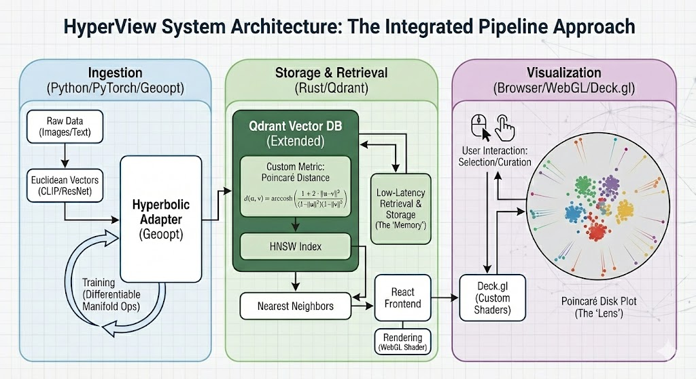

# HyperView System Architecture

## The Integrated Pipeline Approach

HyperView is built as a three-stage pipeline that turns raw multimodal data into an interactive, fairness-aware view of a dataset. Each stage uses the tool best suited for the job:

*   **Ingestion – Python (PyTorch/Geoopt):** Differentiable manifold operations and training of the Hyperbolic Adapter.
*   **Storage & Retrieval – Rust (Qdrant):** Low-latency vector search with a custom Poincaré distance metric.
*   **Visualization – Browser (WebGL/Deck.gl):** GPU-accelerated rendering of the Poincaré disk in the browser.

## System Diagram

  

## Component Breakdown

### 1. Ingestion: Hyperbolic Adapter (Python)
*   **Role:** The bridge between flat (Euclidean) model embeddings and curved (hyperbolic) space.
*   **Input:** Raw data (images/text) → standard model embeddings (e.g. CLIP/ResNet vectors).
*   **Tech:** PyTorch, Geoopt.
*   **Function:**
    * Learns a small Hyperbolic Adapter using differentiable manifold operations.
    * Uses the exponential map (`expmap0`) to project Euclidean vectors into the Poincaré ball.
    * This is where minority and rare cases are expanded away from the crowded center so they remain distinguishable.

### 2. Storage & Retrieval: Vector Engine (Rust / Qdrant)
*   **Role:** The memory that stores and retrieves hyperbolic embeddings at scale.
*   **Tech:** Qdrant (forked/extended in Rust).
*   **Challenge:** Standard vector DBs only support dot, cosine, or Euclidean distance.
*   **Solution:**
    * Implement a custom `PoincareDistance` metric in Rust:
      $$d(u, v) = \text{arccosh}\left(1 + 2 \frac{\lVert u - v\rVert^2}{(1 - \lVert u\rVert^2)(1 - \lVert v\rVert^2)}\right)$$
    * Plug this metric into Qdrant’s HNSW index for fast nearest-neighbor search in hyperbolic space.
    * This allows search results to respect the hierarchy in the data instead of collapsing the long tail.

### 3. Visualization: Poincaré Disk Viewer (WebGL)
*   **Role:** The lens that lets humans explore the structure of the dataset.
*   **Tech:** React, Deck.gl, custom WebGL shaders.
*   **Challenge:** Rendering 1M points in non-Euclidean geometry directly in the browser.
*   **Solution:**
    * Send raw hyperbolic coordinates to the GPU and render them directly onto the Poincaré disk using a custom shader (no CPU-side projection).
    * Provide pan/zoom/selection so curators can inspect minority clusters, isolate rare subgroups at the boundary, and export curated subsets.

## Data Flow: The Fairness Pipeline

1.  **Ingest:** User uploads a dataset (e.g. medical images, biodiversity data).
2.  **Embed:** Standard models (CLIP/ResNet/Whisper) produce Euclidean embeddings.
3.  **Expand:** The Hyperbolic Adapter projects them into the Poincaré ball; rare cases move towards the boundary instead of being crushed.
4.  **Index:** Qdrant stores these hyperbolic vectors with the custom Poincaré distance metric.
5.  **Query:** A user clicks on a minority example or defines a region of interest.
6.  **Search:** Qdrant returns semantic neighbors according to Poincaré distance, preserving the hierarchy between majority, minority, and rare subgroups.
7.  **Visualize & Curate:** The browser renders the Poincaré disk, highlighting clusters and long-tail regions so users can see gaps, remove duplicates, and build fairer training sets.
